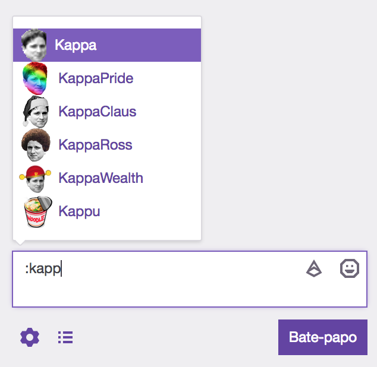
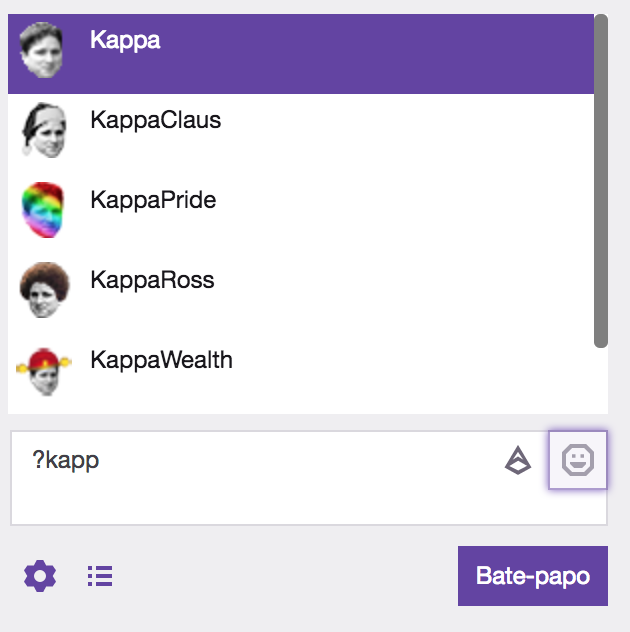

## Twitch Emotes Remembrall


A Chrome Extension that enhance the Twitch chat experience with face emotes autocompletion.

All face emotes from [Twitch Emotes](https://twitchemotes.com) are supported.

# Introduction and Inspiration

It is hard to remember all Face Emotes on Twitch.

This chrome extension adds a new command **`?`** that tries to simulate the Twitch chat **`:`** command.

### The original version (**`:`**)



### The Remebrall version (**`?`**)



# Installation
On the Chrome browser, type the following url:

```
chrome://extensions
```

* Enable Developer Mode
* Click load unpacked extension...
* Select the twitch-emotes folder

Note: When the code is changed, it is necessary to click Reload on the Twitch Emotes Remembrall extension.

# Contributing

It is only required to follow the [standard.js](https://standardjs.com) guidelines.


# Resources
* [Learn to create Chrome extensions](http://shiffman.net/a2z/chrome-ext)
* [manifest.js Docs](https://developer.chrome.com/extensions/manifest)

# TODO
* The content script needs to refresh on page change.
